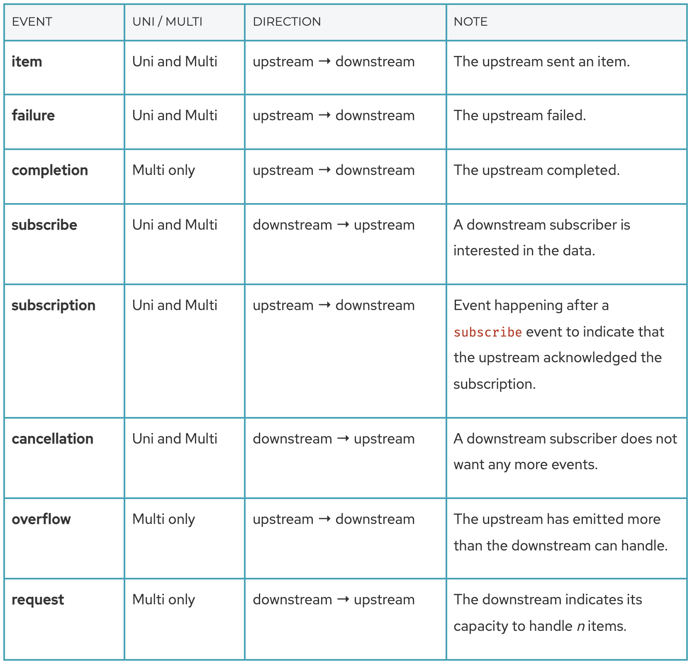
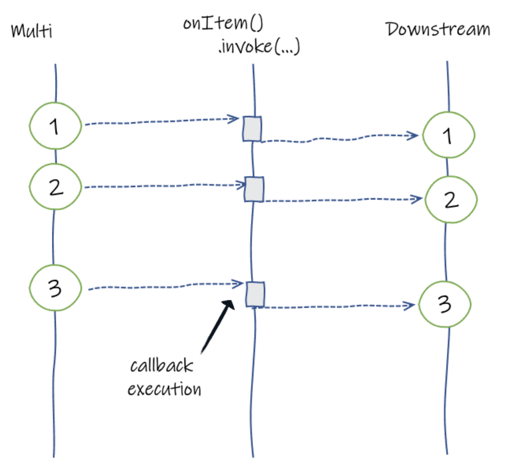
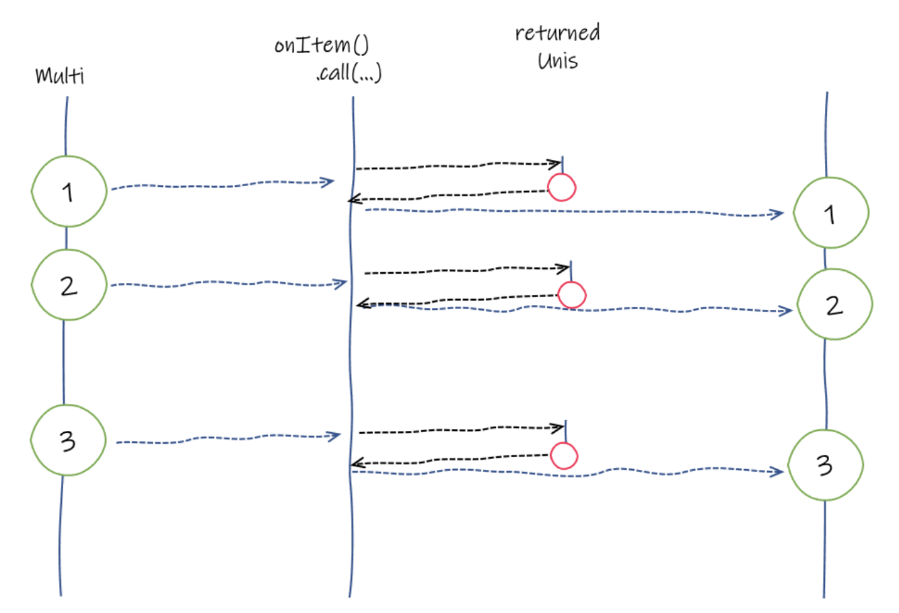
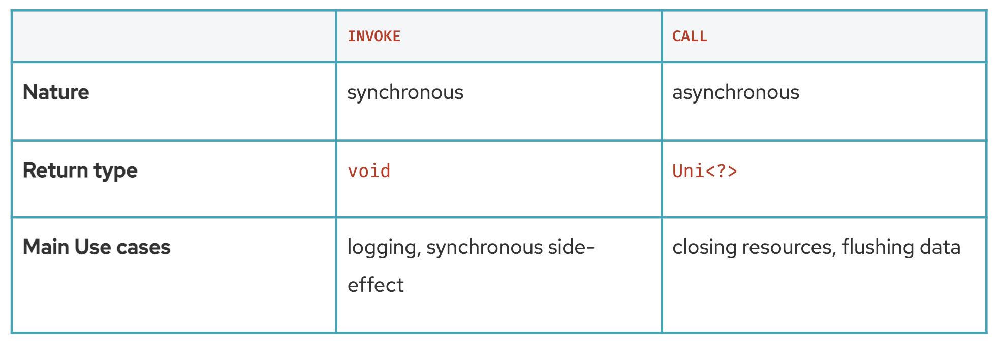

# Quarkus

## Mutiny

### `Uni`

- A `Uni` represents a stream that can only emit either an item or a failure event. You rarely create instances of `Uni`
  yourself, but, instead, use a reactive client exposing a Mutiny API that provides Unis. That being said, it can be
  handy at times.
- A `Uni<T>` is a specialized stream that emits only an item or a failure. Typically, `Uni<T>` are great to represent
  asynchronous actions such as a remote procedure call, an HTTP request, or an operation producing a single result.
- `Uni<T>` provides many operators that create, transform, and orchestrate `Uni` sequences.
- As said, `Uni<T>` emits either an **item** or a **failure**. Note that the item can be `null`, and the `Uni` API has
  specific methods for this case.
- Unis are lazy by nature. To trigger the computation, you must have a final subscriber indicating your interest.

    ```kotlin
    fun creatingUnis() {
        val num = 10
        val item: Uni<Int> = Uni.createFrom().item(num)
        val supplier = Uni.createFrom().item { num * 5 }
    }
    
    fun creatingFailingUnis() {
        val exception = Uni.createFrom().failure<Int>(Exception("Invalid Int"))
        val exceptionWithASupplier = Uni.createFrom().failure<Int> { Exception("Exception using Supplier") }
    }
    
    fun creatingEmptyUni() {
        val nullItem = Uni.createFrom().nullItem<Int>()
    }
    
    fun creatingUniFromEmitter() {
        Uni.createFrom().emitter<String> {
            it.complete("result")
        }
    }
    ```

### `Multi`

- A `Multi` represents a stream of data. A stream can emit 0, 1, n, or an infinite number of items. A `Multi<T>` is a
  data stream that:
    - emits 0..n item events
    - emits a failure event
    - emits a completion event for bounded streams

  > - Failures are terminal events: after having received a failure no further item will be emitted.
  > - You will rarely create instances of `Multi` yourself but instead use a reactive client that exposes a Mutiny API. Still, just like `Uni` there exists a rich API for creating `Multi` objects.

- `Multis` are lazy by nature. To trigger the computation, you must subscribe.
- `Multi<T>` provides many operators that create, transform, and orchestrate Multi sequences. The operators can be used
  to define a processing pipeline. The events flow in this pipeline, and each operator can process or transform the
  events.

  ```kotlin
  // Create a Multi from a list of Ints
  val multi = Multi.createFrom().items(1, 2, 3, 4)
  
  // Subscribing to a Multi
  val cancellable: Cancellable =
      multi
          .subscribe()
          .with(
              { println("Item $it") }, // Subscribing each item
              { println("Failed with $it") }, // On Failure
              { println("Completed") } // On Completion
          )
  
  // Creating Multi from an Intstream
  val items1 = Multi.createFrom()
      .items { IntStream.range(1, 10).boxed() }
  
  // Creating Multi from a collection
  val items2 = Multi.createFrom()
      .iterable(listOf(1, 2, 3, 4, 5, 6))
  
  // Creating failing Multis
  val exception = Multi.createFrom().failure<Int>(Exception("Some Exception"))
  val exception2 = Multi.createFrom().failure<Int> { Exception("Another Exception") }
  
  // Creating empty Multis
  val empty = Multi.createFrom().empty<Int>()
  
  // Creating Multi from emitter
  val items: Multi<Int> = Multi.createFrom()
      .emitter {
          it.emit(1)
          it.emit(2)
          it.emit(3)
          it.complete()
      }
  
  // Creating Multi from ticks
  val ticks = Multi.createFrom()
      .ticks().every(Duration.ofMillis(100))
  
  ```

### Events

- `Uni` and `Multi` emit events. Your code is going to observe and process these events. Most of the time, your code is
  only interested in item and failure events. But there are other kinds of events such as cancellation, request,
  completion, and so on:

  

- For each kind of event, there is an associated group providing the methods to handle that specific event: `onItem()`
  , `onFailure()`, `onCompletion()` and so on.

- These groups provide two methods to **peek** at the various events without impacting its distribution: `invoke(…)`
  and `call(…)`. **It does not transform the received event; it notifies you that something happened and let you react.
  Once this _reaction_ completes, the event is propagated downstream or upstream depending on the direction of the
  event.**

#### The `invoke` method

- The `invoke` method is synchronous and the passed callback does not return anything. Mutiny invokes the configured
  callback when the observed stream dispatches the event and propagates the event downstream when the callback returns.
  It blocks the dispatching.

  

  > The invoke method does not change the event, except in one case. If the callback throws an exception, the downstream does not get the actual event but get a failure event instead.

#### The `call` method

- Unlike `invoke`, `call` is asynchronous, and the callback returns a `Uni<?>` object. `call` is often used when you
  need to implement asynchronous side-effects, such as closing resources.

- Mutiny does not dispatch the original event downstream until the Uni returned by the callback emits an item.

  

  > - Under the hood, Mutiny gets the `Uni` (by invoking the callback) and subscribes to it. It observes the item or failure event from that Uni. It discards the item value as only the emission matters in this case.
  > - If the callback throws an exception or the produced `Uni` produces a failure, Mutiny propagates that failure (or a `CompositeException`) downstream, replacing the original event.

#### Difference between `invoke` and `call`

  
